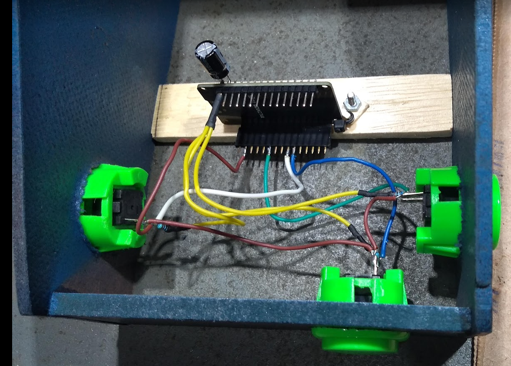

# Controlador Bluetooth baseado no ESP32  para o jogo Zen Pinball - Android
Nesse repositório será disponibilizado o firmware e documentação para montagem do hardware

  
  

# Diagrama Esquemático

Exemplo montagem Hardware

# Firmware e Gravador
A gravação do firmware é simplificada com a utilização da aplicação gravador. Após montar o hardware conforme indicado no diagrama acima e conectar o módulo ESP32 ao PC siga os passos: 

1. Faça o download da aplicação Gravador Firmware. ([Download](firmware/gravador_firmware_pinball_avaliacao.zip))
2. Descompactar o arquivo **gravador_firmware_pinball_avaliacao.zip** na pasta de sua escolha
3. Execute a aplicação **gravador.exe**
4. Na interface gráfica selecionar a porta de comunicação em seguida clicar no botão **Gravar**. O firmware será gravado, na sequencia o ESP32 é reiniciado e está pronto para utilização.
5. No dispositivo Android faça o pareamento Bluetooth, seu dispositivo está pronto para uso com o Zen Pinball

**Observação Importante**: Esse firmware é uma versão de avaliação com a limitação do controle direito estar desabilitado. Faça seus testes e caso goste do projeto entre em contato pelo email fazerlab@gmail.com  para  informações de como obter o projeto com o firmware no modo completo. 

 # Atividades:
- [x] Diagrama Esquemático
- [x] Firmware
- [ ] Manual de configuração e uso
- [ ] Tutoriais

