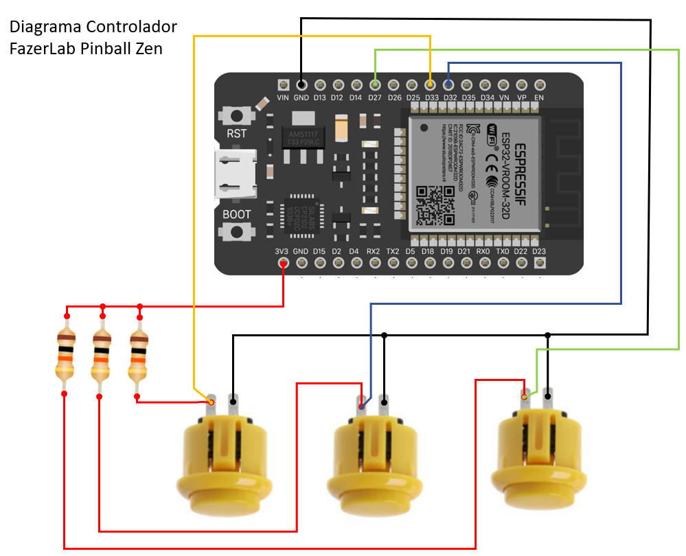

# Controlador Bluetooth baseado no ESP32  para o jogo Zen Pinball - Android
Nesse repositório será disponibilizado o firmware e documentação para montagem do hardware

  
  

# Diagrama Esquemático

Montagem do Hardware

 # Atividades:
- [x] Diagrama Esquemático
- [ ] Firmware
- [ ] Manual de configuração e uso
- [ ] Tutoriais

